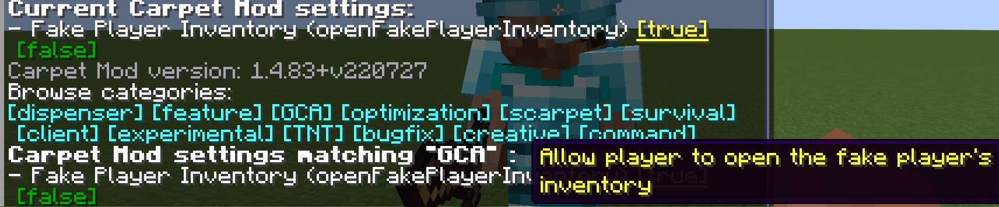
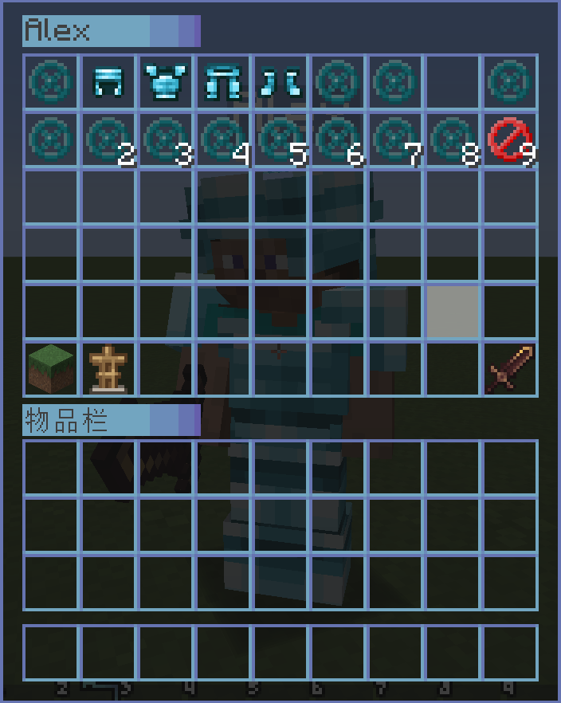
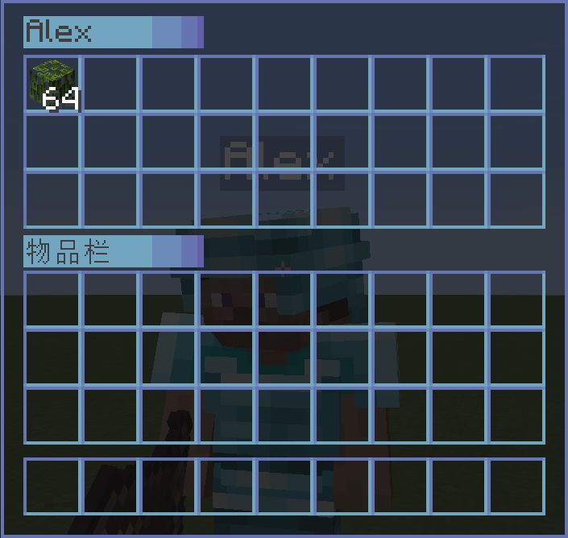

# Gugle's Carpet Addition [ English | [中文](README_cn.md) ]

## GCA
### openFakePlayerInventory
* Use `/carpet openFakePlayerInventory true` Allow player to open the fake player's inventory

  

* Use `/carpet openFakePlayerEnderChest true` Allow player to open the fake player's ender chest

  Sneak to open the fake player's ender chest

  