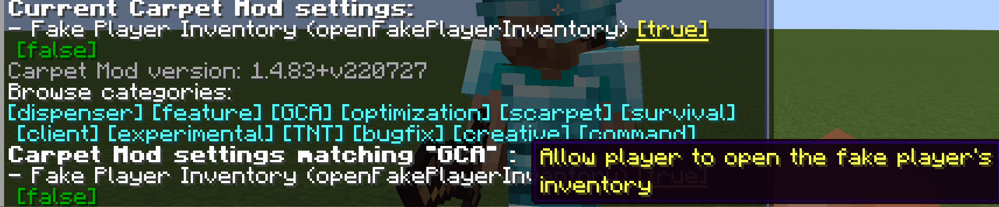
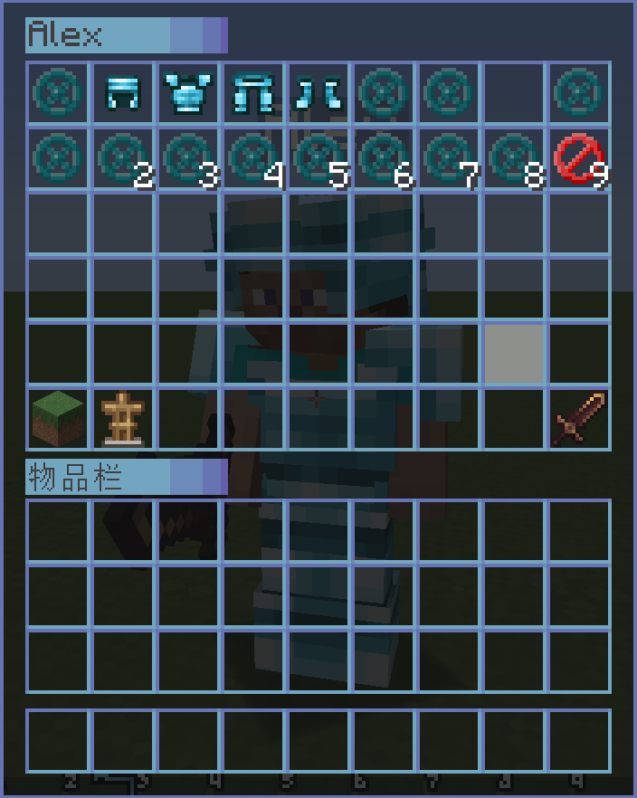
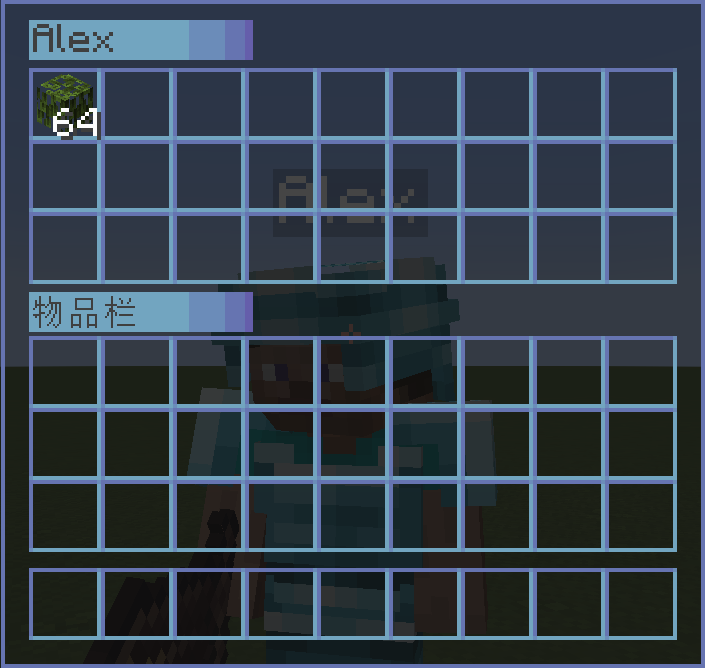

# Gugle's Carpet Addition [ English | [中文](README_cn.md) ]

[](https://github.com/Gu-ZT/gugle-carpet-addition/actions/workflows/build.yml)
[](https://www.curseforge.com/minecraft/mc-mods/guglecarpetaddition)
[](https://modrinth.com/mod/gca)
[](https://github.com/Gu-ZT/gugle-carpet-addition/releases)



## GCA

#### If you need GCA for Minecraft 1.13, [please click here](https://github.com/Gu-ZT/TISCarpet113WithGCA/releases/latest)

### gcaPageSize

Set the number of entries per page on GCA list pages

* Type: `int`
* Default: `8`
* Options: Any positive integer
* Categories: `GCA`

```
/carpet [setDefault] gcaPageSize 10
```

### openFakePlayerInventory

Allow player to open the fake player's inventory

* Type: `boolean`
* Default: `false`
* Options: `true`, `false`
* Categories: `GCA`, `BOT`

```
/carpet [setDefault] openFakePlayerInventory true
```

**Usage**: Right-click on a fake player to open their inventory



### openRealPlayerInventory

Allow player to open the real player's inventory

* Type: `String`
* Default: `false`
* Options: `true`, `false`, `ops`, `0`, `1`, `2`, `3`, `4`
* Categories: `GCA`, `experimental`

```
/carpet [setDefault] openRealPlayerInventory true
/carpet [setDefault] openRealPlayerInventory ops
```

**Usage**: Right-click on other real players to open their inventory, requires appropriate permission level

### openFakePlayerEnderChest

Allow player to open the fake player's ender chest

* Type: `String`
* Default: `false`
* Options: `ender_chest`, `true`, `false`
* Categories: `GCA`, `BOT`

```
/carpet [setDefault] openFakePlayerEnderChest true
/carpet [setDefault] openFakePlayerEnderChest ender_chest
```

**Usage**: Sneak (hold Shift) + right-click on a fake player to open their ender chest



### fakePlayerResident

Keep the fake player when exiting the level

* Type: `boolean`
* Default: `false`
* Options: `true`, `false`
* Categories: `GCA`, `BOT`

```
/carpet [setDefault] fakePlayerResident true
```

### fakePlayerReloadAction

Keep the fake player action when exiting the level

* Type: `boolean`
* Default: `true`
* Options: `true`, `false`
* Categories: `GCA`, `BOT`

```
/carpet [setDefault] fakePlayerReloadAction false
```

### fakePlayerAutoRespawn

Make the fake player automatically respawn after death

* Type: `String`
* Default: `false`
* Options: `spawn`, `death`, `setting`, `false`
* Categories: `GCA`, `BOT`, `experimental`

> `spawn`: Respawning at the spawn point.

> `death`: Respawning at the death location.

> `setting`: Respawning at the location stored in the bot list. If the fake player is not in the bot list, the `death` mode will be used.

```
/carpet [setDefault] fakePlayerAutoRespawn <spawn|death|setting>
```

### fakePlayerAutoReplenishment

Make fake player to auto replenishment

* Type: `boolean`
* Default: `false`
* Options: `true`, `false`
* Categories: `GCA`, `BOT`

```
/carpet [setDefault] fakePlayerAutoReplenishment true
```

### fakePlayerAutoReplenishmentFormShulkerBox

Make fake player to auto replenishment from shulker box

* Type: `boolean`
* Default: `false`
* Options: `true`, `false`
* Categories: `GCA`, `BOT`

```
/carpet [setDefault] fakePlayerAutoReplenishmentFormShulkerBox true
```

### fakePlayerAutoFish

Make fake player to auto fish. When the fishing hook catches a fish, it will automatically reel in and cast again.

* Type: `boolean`
* Default: `false`
* Options: `true`, `false`
* Categories: `GCA`, `BOT`

```
/carpet [setDefault] fakePlayerAutoFish true
```

**Usage**: Let the fake player hold a fishing rod and use `/player <name> use` to start fishing. The fake player will automatically complete the reel-in and cast operations.

### fakePlayerAutoReplaceTool

Make fake player to auto replace almost damaged tool

* Type: `String`
* Default: `false`
* Options: `true`, `false`, `keep`
* Categories: `GCA`, `BOT`

> `true`: Tools with Mending will keep 10 durability; other tools will automatically be replaced after they break.

> `keep`: All tools will keep 10 durability.

```
/carpet [setDefault] fakePlayerAutoReplaceTool <true|keep>
```

### fakePlayerToolDamagedNotification

Broadcast a server-wide message when a fake player's tool breaks or when restocking fails (May cause message spam)

* Type: `boolean`
* Default: `false`
* Options: `true`, `false`
* Categories: `GCA`, `BOT`

```
/carpet [setDefault] fakePlayerToolDamagedNotification true
```

### fakePlayerPrefixName

Fake Player Prefix Name

* Type: `String`
* Default: `#none`
* Options: `#none`, `bot_`
* Categories: `GCA`, `BOT`

```
/carpet [setDefault] fakePlayerPrefixName bot_
/carpet [setDefault] fakePlayerPrefixName #none
```

### fakePlayerSuffixName

Fake Player Suffix Name

* Type: `String`
* Default: `#none`
* Options: `#none`, `_fake`
* Categories: `GCA`, `BOT`

```
/carpet [setDefault] fakePlayerSuffixName _fake
/carpet [setDefault] fakePlayerSuffixName #none
```

### fakePlayerForceOfflineUUID

Force fake players to use offline UUIDs (requires `allowSpawningOfflinePlayers` enabled)

* Type: `boolean`
* Default: `false`
* Options: `true`, `false`
* Categories: `GCA`, `BOT`

```
/carpet [setDefault] fakePlayerForceOfflineUUID true
```

> Disabling this feature requires clearing usercache.json and restarting the server/client to switch back to online UUIDs.

### commandBot

A Bot Management Menu for saving, loading, and grouping fake players

* Type: `String`
* Default: `ops`
* Options: `ops`, `0`, `1`, `2`, `3`, `4`, `true`, `false`
* Categories: `GCA`, `BOT`, `command`

```
/carpet [setDefault] commandBot ops
```

**Command Usage**:
```
/bot                                    # Show saved bot list
/bot list [page]                        # Show bot list with pagination
/bot add <player> <desc>                # Save current online fake player (including position, actions, etc.)
/bot load <player>                      # Load saved fake player
/bot remove <player>                    # Delete saved fake player
/bot group                              # Show bot group list
/bot group create <name>                # Create bot group
/bot group remove <name>                # Delete bot group
/bot group add <bot> <group>            # Add bot to group
/bot group load <group>                 # Load all bots in group
/bot group unload <group>               # Unload all bots in group
/bot group info <group>                 # View group details
/bot group generated <name> <count> [load]  # Batch generate bots and group them
```

#### Bot Controller

Use `/bot controller` to customize buttons on a fake player's extra control panel. Buttons can be configured globally or for an individual fake player. An individual setting overrides the global setting when both use the same slot.

Slots `3` through `26` are available. Clicking a button runs the configured `/player <player> <action>` command using the target fake player's name, so `<action>` should contain only the part after the player name. For example, `attack continuous` runs `/player <player> attack continuous`.

**Command Usage**:
```
/bot controller                                             # Show the global button list
/bot controller list [player]                               # Show global buttons or the effective buttons for a player
/bot controller global set <slot> <desc> <action>           # Set a global button
/bot controller global clear <slot>                         # Clear a global button from a slot
/bot controller global clear all                            # Clear all global buttons
/bot controller player <player> set <slot> <desc> <action>  # Set a button for one fake player
/bot controller player <player> clear <slot>                # Clear one button for a fake player
/bot controller player <player> clear all                   # Clear all buttons for a fake player
```

**Examples**:
```
/bot controller global set 3 "Continuous Attack" attack continuous
/bot controller player Steve set 4 "Continuous Use" use continuous
```

Enable `openFakePlayerInventory` or `openFakePlayerEnderChest`, then sneak and right-click a fake player to open the extra control panel. When the fake player's ender chest is enabled, the control buttons appear above its contents. Button descriptions containing spaces must be enclosed in double quotes.

### commandBotAction

A Bot Action Management Menu for adding/removing actions and setting startup actions for bots

* Type: `String`
* Default: `ops`
* Options: `ops`, `0`, `1`, `2`, `3`, `4`, `true`, `false`
* Categories: `GCA`, `BOT`, `command`

```
/carpet [setDefault] commandBotAction ops
```

**Command Usage**:
```
/bot action <bot>                       # View bot's action list
/bot action <bot> add <action>          # Add action to bot
/bot action <bot> remove <id>           # Remove action from bot
/bot action <bot> startup set <action>  # Set bot's startup action
/bot action <bot> startup clear         # Clear bot's startup actions
```

### commandTodo

A Todo Management Menu with support for adding, removing, and marking completion

* Type: `String`
* Default: `ops`
* Options: `ops`, `0`, `1`, `2`, `3`, `4`, `true`, `false`
* Categories: `GCA`, `command`

```
/carpet [setDefault] commandTodo ops
```

**Command Usage**:
```
/todo                           # Show todo list
/todo list [page]               # Show todo list with pagination
/todo add <desc>                # Add new todo item
/todo remove <id>               # Remove todo item
/todo success <id> [true/false] # Mark todo as done/undone
```

### commandHere

Quickly broadcast your current position to all players and add glowing effect to yourself

* Type: `String`
* Default: `ops`
* Options: `ops`, `0`, `1`, `2`, `3`, `4`, `true`, `false`
* Categories: `GCA`, `command`
* Conditions: Only works when CarpetAmsAddition is NOT loaded

```
/carpet [setDefault] commandHere ops
```

**Command Usage**:
```
/here   # Broadcast your coordinates, showing current dimension and converted coordinates
        # Also outputs Xaero's Minimap compatible waypoint format
```

### commandWhereis

Quickly locate players and add glowing effect to target

* Type: `String`
* Default: `ops`
* Options: `ops`, `0`, `1`, `2`, `3`, `4`, `true`, `false`
* Categories: `GCA`, `command`

```
/carpet [setDefault] commandWhereis ops
```

**Command Usage**:
```
/whereis <player>   # Query specified player's location
/vris <player>      # Alias, same function
```

### commandLoc

A Location Management Menu for saving, viewing, and deleting location points

* Type: `String`
* Default: `ops`
* Options: `ops`, `0`, `1`, `2`, `3`, `4`, `true`, `false`
* Categories: `GCA`, `command`

```
/carpet [setDefault] commandLoc ops
```

**Command Usage**:
```
/loc                    # Show location list
/loc list [page]        # Show locations with pagination
/loc add <desc>         # Add location at current position
/loc remove <id>        # Remove specified location
/loc info <id>          # View location details (including dimension converted coordinates)
```

### commandWlist

Whitelist Management, allows authorized regular players to manage the whitelist

* Type: `boolean`
* Default: `false`
* Options: `true`, `false`
* Categories: `GCA`, `command`

```
/carpet [setDefault] commandWlist true
```

**Command Usage**:
```
/wlist                              # Show current whitelist
/wlist add <player>                 # Add player to whitelist
/wlist remove <player>              # Remove player from whitelist
/wlist permission add <player>      # Grant player whitelist management permission (OP only)
/wlist permission remove <player>   # Revoke player's whitelist management permission (OP only)
```

### commandBlist

Banned List Management

* Type: `boolean`
* Default: `false`
* Options: `true`, `false`
* Categories: `GCA`, `command`

```
/carpet [setDefault] commandBlist true
/blist
```

### commandSop

Simple op get

* Type: `boolean`
* Default: `false`
* Options: `true`, `false`
* Categories: `GCA`, `command`

```
/carpet [setDefault] commandSop true
/sop
```

### commandSeed

Sets the required permission level for the /seed command

* Type: `String`
* Default: `vanilla`
* Options: `vanilla`, `true`, `false`, `ops`, `0`, `1`, `2`, `3`, `4`
* Categories: `GCA`, `command`

```
/carpet [setDefault] commandSeed ops
/carpet [setDefault] commandSeed 0
```

### betterFenceGatePlacement

Make the placed fence gate have the same block status as the fence gate you clicked

* Type: `boolean`
* Default: `false`
* Options: `true`, `false`
* Categories: `GCA`

```
/carpet [setDefault] betterFenceGatePlacement true
```

### betterWoodStrip

Only the axe with "Strip" in its name is allowed to peel logs

* Type: `boolean`
* Default: `false`
* Options: `true`, `false`
* Categories: `GCA`

```
/carpet [setDefault] betterWoodStrip true
```

### betterSignInteraction

Make the block attached to the sign interact when you right-click it

* Type: `boolean`
* Default: `false`
* Options: `true`, `false`
* Categories: `GCA`

```
/carpet [setDefault] betterSignInteraction true
```

### betterItemFrameInteraction

Make the block attached to the ItemFrame interact when you right-click it

* Type: `boolean`
* Default: `false`
* Options: `true`, `false`
* Categories: `GCA`

```
/carpet [setDefault] betterItemFrameInteraction true
```

### betterQuickCrafting

Keep an item in the inventory during quick crafting

* Type: `boolean`
* Default: `false`
* Options: `true`, `false`
* Categories: `GCA`, `experimental`

```
/carpet [setDefault] betterQuickCrafting true
```

### simpleInGameCalculator

Simple In-Game Calculator

* Type: `boolean`
* Default: `false`
* Options: `true`, `false`
* Categories: `GCA`

```
/carpet [setDefault] simpleInGameCalculator true
```

### fastPingFriend

Fast ping friend

* Type: `boolean`
* Default: `false`
* Options: `true`, `false`
* Categories: `GCA`

```
/carpet [setDefault] fastPingFriend true
```

### qnmdLC

What is the height value for setting the LC value

* Type: `int`
* Default: `-1`
* Categories: `GCA`, `experimental`

```
/carpet [setDefault] qnmdLC 64
/carpet [setDefault] qnmdLC -1
```

### fixedEndCrystalSync

Fixed End Crystal Sync

* Type: `boolean`
* Default: `false`
* Options: `true`, `false`
* Categories: `GCA`, `experimental`

```
/carpet [setDefault] fixedEndCrystalSync true
```

### welcomePlayer

Welcome Player

* Type: `boolean`
* Default: `false`
* Options: `true`, `false`
* Categories: `GCA`

```
/carpet [setDefault] welcomePlayer true
```

### wanderingTraderSpawnFailedWarning

Wandering Trader Spawn Failed Warning

* Type: `boolean`
* Default: `false`
* Options: `true`, `false`
* Categories: `GCA`, `experimental`

```
/carpet [setDefault] wanderingTraderSpawnFailedWarning true
```

### wanderingTraderSpawnRemind

Wandering Trader Spawn Remind

* Type: `boolean`
* Default: `false`
* Options: `true`, `false`
* Categories: `GCA`, `experimental`

```
/carpet [setDefault] wanderingTraderSpawnRemind true
```

### commandTransfer

/transfer command

* Type: `boolean`
* Default: `false`
* Options: `true`, `false`
* Categories: `GCA`, `command`
* Conditions: Requires Minecraft >= 1.21

```
/carpet [setDefault] commandTransfer true
/transfer <server> [port]
```

### commandTick

Fix Carpet's /tick command permission

* Type: `String`
* Default: `3`
* Options: `true`, `false`, `ops`, `0`, `1`, `2`, `3`, `4`
* Categories: `GCA`, `command`, `experimental`
* Conditions: Requires Minecraft >= 1.20.3

```
/carpet [setDefault] commandTick 3
```

### fakePlayerLocatorBar

Display Fake Player Positions On The Locator Bar

* Type: `boolean`
* Default: `true`
* Options: `true`, `false`
* Categories: `GCA`, `command`, `BOT`
* Conditions: Requires Minecraft >= 1.21.6

```
/carpet [setDefault] fakePlayerLocatorBar true
```
