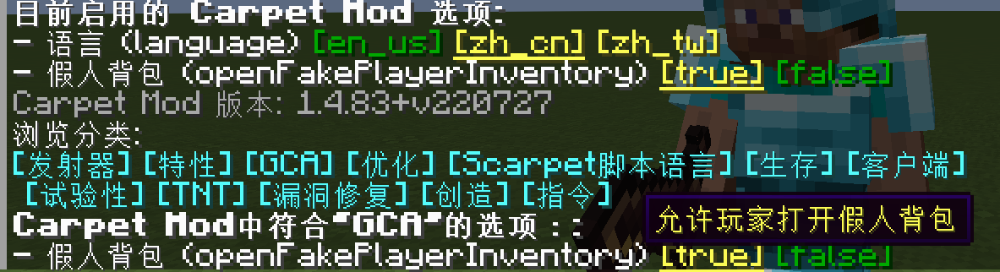

# Gugle的Carpet附加包 [ [English](README.md) | 中文 ]

## GCA
### 假人背包
* 使用 `/carpet openFakePlayerInventory true` 允许玩家打开假人背包

  

* 使用 `/carpet openFakePlayerEnderChest true` 允许玩家打开假人末影箱

  潜行可以打开假人的末影箱

  
