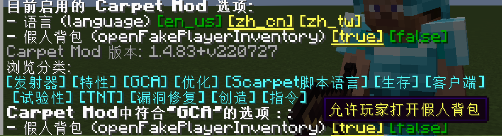

# Gugle的Carpet附加包 [ [English](README.md) | 中文 ]

[](https://github.com/Gu-ZT/gugle-carpet-addition/actions/workflows/build.yml)
[](https://www.curseforge.com/minecraft/mc-mods/guglecarpetaddition)
[](https://modrinth.com/mod/gca)
[](https://github.com/Gu-ZT/gugle-carpet-addition/releases)


## GCA

#### 如果你需要Minecraft 1.13版本的GCA, [请点击此处](https://github.com/Gu-ZT/TISCarpet113WithGCA/releases/latest)

### 假人背包 (openFakePlayerInventory)

允许玩家打开假人背包

* 类型: `boolean`
* 默认值: `false`
* 参考选项: `true`, `false`
* 分类: `GCA`, `BOT`

```
/carpet openFakePlayerInventory true
```

**使用方法**: 右键点击假人即可打开其背包界面


### 真人背包 (openRealPlayerInventory)

允许玩家打开真人背包

* 类型: `String`
* 默认值: `false`
* 参考选项: `true`, `false`, `ops`, `0`, `1`, `2`, `3`, `4`
* 分类: `GCA`, `experimental`

```
/carpet openRealPlayerInventory true
/carpet openRealPlayerInventory ops
```

**使用方法**: 右键点击其他真实玩家即可打开其背包界面，需要相应权限等级

### 假人末影箱 (openFakePlayerEnderChest)

允许玩家打开假人末影箱

* 类型: `String`
* 默认值: `false`
* 参考选项: `ender_chest`, `true`, `false`
* 分类: `GCA`, `BOT`

```
/carpet openFakePlayerEnderChest true
/carpet openFakePlayerEnderChest ender_chest
```

**使用方法**: 潜行(按住Shift)+右键点击假人即可打开其末影箱


### 假人驻留 (fakePlayerResident)

退出存档时保留假人

* 类型: `boolean`
* 默认值: `false`
* 参考选项: `true`, `false`
* 分类: `GCA`, `BOT`

```
/carpet fakePlayerResident true
```

### 假人动作保存 (fakePlayerReloadAction)

退出存档时保留假人动作

* 类型: `boolean`
* 默认值: `false`
* 参考选项: `true`, `false`
* 分类: `GCA`, `BOT`

```
/carpet fakePlayerReloadAction true
```

### 假人补货 (fakePlayerAutoReplenishment)

让假人自动补货

* 类型: `boolean`
* 默认值: `false`
* 参考选项: `true`, `false`
* 分类: `GCA`, `BOT`

```
/carpet fakePlayerAutoReplenishment true
```

### 假人潜影盒补货 (fakePlayerAutoReplenishmentFormShulkerBox)

让假人自动从潜影盒补货

* 类型: `boolean`
* 默认值: `false`
* 参考选项: `true`, `false`
* 分类: `GCA`, `BOT`

```
/carpet fakePlayerAutoReplenishmentFormShulkerBox true
```

### 假人钓鱼 (fakePlayerAutoFish)

让假人自动钓鱼，当鱼钩捕获到鱼时自动收竿并重新抛出

* 类型: `boolean`
* 默认值: `false`
* 参考选项: `true`, `false`
* 分类: `GCA`, `BOT`

```
/carpet fakePlayerAutoFish true
```

**使用方法**: 让假人手持鱼竿并使用 `/player <name> use` 开始钓鱼，假人会自动完成收竿和抛竿操作

### 假人切换工具 (fakePlayerAutoReplaceTool)

让假人自动切换损坏的工具

* 类型: `String`
* 默认值: `false`
* 参考选项: `true`, `false`, `keep`
* 分类: `GCA`, `BOT`

```
/carpet fakePlayerAutoReplaceTool true
```

> 当选项为 `true` 时有经验修补的工具会保留10点耐久, 其他在损坏后自动切换

> 当选项为 `keep` 时所有工具都会保留10点耐久

### 假人名称前缀 (fakePlayerPrefixName)

假人名称前缀

* 类型: `String`
* 默认值: `#none`
* 参考选项: `#none`, `bot_`
* 分类: `GCA`, `BOT`

```
/carpet fakePlayerPrefixName bot_
/carpet fakePlayerPrefixName #none
```

### 假人名称后缀 (fakePlayerSuffixName)

假人名称后缀

* 类型: `String`
* 默认值: `#none`
* 参考选项: `#none`, `_fake`
* 分类: `GCA`, `BOT`

```
/carpet fakePlayerSuffixName _fake
/carpet fakePlayerSuffixName #none
```

### 假人管理 (commandBot)

一个假人管理菜单，可以保存、加载、分组管理假人

* 类型: `String`
* 默认值: `ops`
* 参考选项: `ops`, `0`, `1`, `2`, `3`, `4`, `true`, `false`
* 分类: `GCA`, `BOT`, `command`

```
/carpet commandBot ops
```

**命令用法**:
```
/bot                                    # 显示已保存的假人列表
/bot list [page]                        # 分页显示假人列表
/bot add <player> <desc>                # 保存当前在线的假人(包括位置、动作等)
/bot load <player>                      # 加载已保存的假人
/bot remove <player>                    # 删除已保存的假人
/bot group                              # 显示假人分组列表
/bot group create <name>                # 创建假人分组
/bot group remove <name>                # 删除假人分组
/bot group add <bot> <group>            # 将假人添加到分组
/bot group load <group>                 # 加载分组内所有假人
/bot group unload <group>               # 卸载分组内所有假人
/bot group info <group>                 # 查看分组详情
/bot group generated <name> <count> [load]  # 批量生成假人并分组
```

### 待办事项管理 (commandTodo)

待办事项管理菜单，支持添加、删除、标记完成

* 类型: `String`
* 默认值: `ops`
* 参考选项: `ops`, `0`, `1`, `2`, `3`, `4`, `true`, `false`
* 分类: `GCA`, `command`

```
/carpet commandTodo ops
```

**命令用法**:
```
/todo                           # 显示待办事项列表
/todo list [page]               # 分页显示待办事项
/todo add <desc>                # 添加新的待办事项
/todo remove <id>               # 删除待办事项
/todo success <id> [true/false] # 标记待办事项完成/未完成
```

### /here 命令 (commandHere)

快速向全服玩家广播你的当前位置，并给自己添加发光效果

* 类型: `String`
* 默认值: `ops`
* 参考选项: `ops`, `0`, `1`, `2`, `3`, `4`, `true`, `false`
* 分类: `GCA`, `command`
* 条件: 仅在未加载 CarpetAmsAddition 时生效

```
/carpet commandHere ops
```

**命令用法**:
```
/here   # 广播你的坐标，显示当前维度坐标和对应维度转换坐标
        # 同时输出 Xaero小地图兼容的路点格式
```

### /whereis 命令 (commandWhereis)

快速定位玩家，显示其位置并给目标添加发光效果

* 类型: `String`
* 默认值: `ops`
* 参考选项: `ops`, `0`, `1`, `2`, `3`, `4`, `true`, `false`
* 分类: `GCA`, `command`

```
/carpet commandWhereis ops
```

**命令用法**:
```
/whereis <player>   # 查询指定玩家的位置
/vris <player>      # 别名，功能相同
```

### 地标管理 (commandLoc)

地标管理菜单，可以保存、查看、删除地标点

* 类型: `String`
* 默认值: `ops`
* 参考选项: `ops`, `0`, `1`, `2`, `3`, `4`, `true`, `false`
* 分类: `GCA`, `command`

```
/carpet commandLoc ops
```

**命令用法**:
```
/loc                    # 显示地标列表
/loc list [page]        # 分页显示地标
/loc add <desc>         # 在当前位置添加地标
/loc remove <id>        # 删除指定地标
/loc info <id>          # 查看地标详细信息(包括维度转换坐标)
```

### 白名单管理 (commandWlist)

白名单管理，允许授权的普通玩家管理白名单

* 类型: `boolean`
* 默认值: `false`
* 参考选项: `true`, `false`
* 分类: `GCA`, `command`

```
/carpet commandWlist true
```

**命令用法**:
```
/wlist                              # 显示当前白名单
/wlist add <player>                 # 添加玩家到白名单
/wlist remove <player>              # 从白名单移除玩家
/wlist permission add <player>      # 授予玩家管理白名单的权限(OP)
/wlist permission remove <player>   # 撤销玩家的白名单管理权限(OP)
```

### 封禁名单管理 (commandBlist)

封禁名单管理

* 类型: `boolean`
* 默认值: `false`
* 参考选项: `true`, `false`
* 分类: `GCA`, `command`

```
/carpet commandBlist true
/blist
```

### 简单获取OP (commandSop)

简单获取OP

* 类型: `boolean`
* 默认值: `false`
* 参考选项: `true`, `false`
* 分类: `GCA`, `command`

```
/carpet commandSop true
/sop
```

### 更好的栅栏门放置 (betterFenceGatePlacement)

让放置的栅栏门与你点击的栅栏门拥有相同的方块状态

* 类型: `boolean`
* 默认值: `false`
* 参考选项: `true`, `false`
* 分类: `GCA`

```
/carpet betterFenceGatePlacement true
```

**使用方法**: 点击已有的栅栏门放置新的栅栏门时，新栅栏门会复制被点击栅栏门的朝向、开关状态、墙内状态等属性

### 更好的原木去皮 (betterWoodStrip)

仅允许名称中包含“去皮”或“Strip”的斧头对原木去皮

* 类型: `boolean`
* 默认值: `false`
* 参考选项: `true`, `false`
* 分类: `GCA`

```
/carpet betterWoodStrip true
```

**使用方法**: 在铁砧上给斧头命名包含“去皮”或“Strip”关键词，该斧头才能对原木进行去皮操作

### 更好的告示牌交互 (betterSignInteraction)

右键墙上告示牌时与其附着的方块产生交互

* 类型: `boolean`
* 默认值: `false`
* 参考选项: `true`, `false`
* 分类: `GCA`

```
/carpet betterSignInteraction true
```

**使用方法**: 右键点击墙上告示牌时，会对告示牌后面的方块触发交互(如开关门、按按钮等)

### 更好的展示框交互 (betterItemFrameInteraction)

右键包含物品的展示框时与其附着的方块产生交互

* 类型: `boolean`
* 默认值: `false`
* 参考选项: `true`, `false`
* 分类: `GCA`

```
/carpet betterItemFrameInteraction true
```

**使用方法**:
- 右键点击展示框时，会对展示框后面的方块触发交互
- 手持仙人掌+玻璃/玻璃板右键点击展示框可切换展示框可见性
- 手持仙人掌打击展示框可取出物品

### 更好的快速合成 (betterQuickCrafting)

快速合成时在物品栏保留一份物品

* 类型: `boolean`
* 默认值: `false`
* 参考选项: `true`, `false`
* 分类: `GCA`, `experimental`

```
/carpet betterQuickCrafting true
```

**使用方法**: 在合成台使用Shift+点击快速合成时，会自动在背包中保留一份每种材料

### 简单的游戏内计算器 (simpleInGameCalculator)

简单的游戏内计算器，支持常用数学函数和常量

* 类型: `boolean`
* 默认值: `false`
* 参考选项: `true`, `false`
* 分类: `GCA`

```
/carpet simpleInGameCalculator true
```

**使用方法**: 在聊天框输入以 `==` 开头的表达式即可计算
```
==1+2*3       # 输出 =7.000000
==sin(pi/2)   # 输出 =1.000000
==sqrt(16)    # 输出 =4.000000
==log(e)      # 输出 =1.000000
```

### 快速Ping好友 (fastPingFriend)

快速Ping好友，向指定玩家发送提醒并播放提示音

* 类型: `boolean`
* 默认值: `false`
* 参考选项: `true`, `false`
* 分类: `GCA`

```
/carpet fastPingFriend true
```

**使用方法**: 在聊天框输入
```
@ <玩家名>    # 普通提醒，播放箭矢击中声
@@ <玩家名>   # 紧急提醒，播放钟声并在屏幕中央显示标题
```

### 设置LC值 (qnmdLC)

设置LC值的高度值是多少

* 类型: `int`
* 默认值: `-1`
* 分类: `GCA`, `experimental`

```
/carpet qnmdLC 64
/carpet qnmdLC -1
```

### 修复末地水晶同步 (fixedEndCrystalSync)

修复末地水晶同步

* 类型: `boolean`
* 默认值: `false`
* 参考选项: `true`, `false`
* 分类: `GCA`, `experimental`

```
/carpet fixedEndCrystalSync true
```

### 欢迎玩家 (welcomePlayer)

欢迎玩家，玩家加入时发送自定义欢迎消息

* 类型: `boolean`
* 默认值: `false`
* 参考选项: `true`, `false`
* 分类: `GCA`

```
/carpet welcomePlayer true
```

**配置方法**: 编辑 `config/gca/welcome.json` 文件，支持的变量类型:
- `gca:player` - 玩家名称
- `gca:day_count` - 服务器运行天数/指定日期起的天数
- `gca:random` - 随机文本
- `gca:server` - 服务器列表(可点击跳转)

### 流浪商人生成失败提醒 (wanderingTraderSpawnFailedWarning)

在流浪商人生成失败进行提醒，并告诉玩家生成失败的原因

* 类型: `boolean`
* 默认值: `false`
* 参考选项: `true`, `false`
* 分类: `GCA`, `experimental`

```
/carpet wanderingTraderSpawnFailedWarning true
```

### 流浪商人生成提醒 (wanderingTraderSpawnRemind)

流浪商人生成提醒

* 类型: `boolean`
* 默认值: `false`
* 参考选项: `true`, `false`
* 分类: `GCA`, `experimental`

```
/carpet wanderingTraderSpawnRemind true
```

### 服务器玩家转移命令 (commandTransfer)

/transfer 命令

* 类型: `boolean`
* 默认值: `false`
* 参考选项: `true`, `false`
* 分类: `GCA`, `command`
* 条件: 需要 Minecraft >= 1.21

```
/carpet commandTransfer true
/transfer <server> [port]
```

### 假人定位条 (fakePlayerLocatorBar)

在定位条上显示假玩家位置

* 类型: `boolean`
* 默认值: `true`
* 参考选项: `true`, `false`
* 分类: `GCA`, `command`, `BOT`
* 条件: 需要 Minecraft >= 1.21.6

```
/carpet fakePlayerLocatorBar true
```
